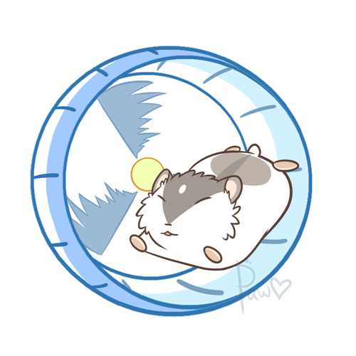

# ICD2O-Final-Project

My final project is a spinner where you put your own sentences, separating them with a comma and the spinner will pick which one you put randomly. 
 

The web application can be viewed at: [Link](https://mths-icd2o-1-2024.github.io/ICD2O-Final-Project-shanea.jaromay/) 
